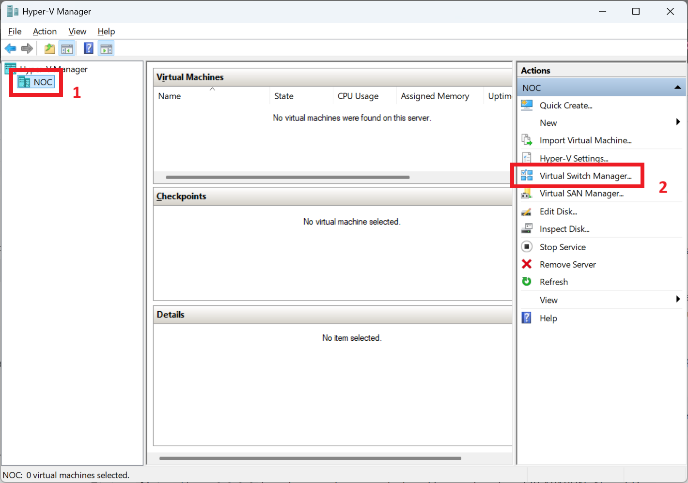
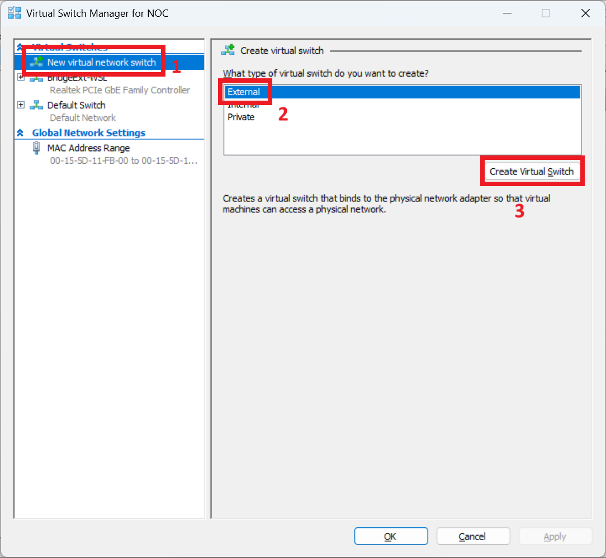
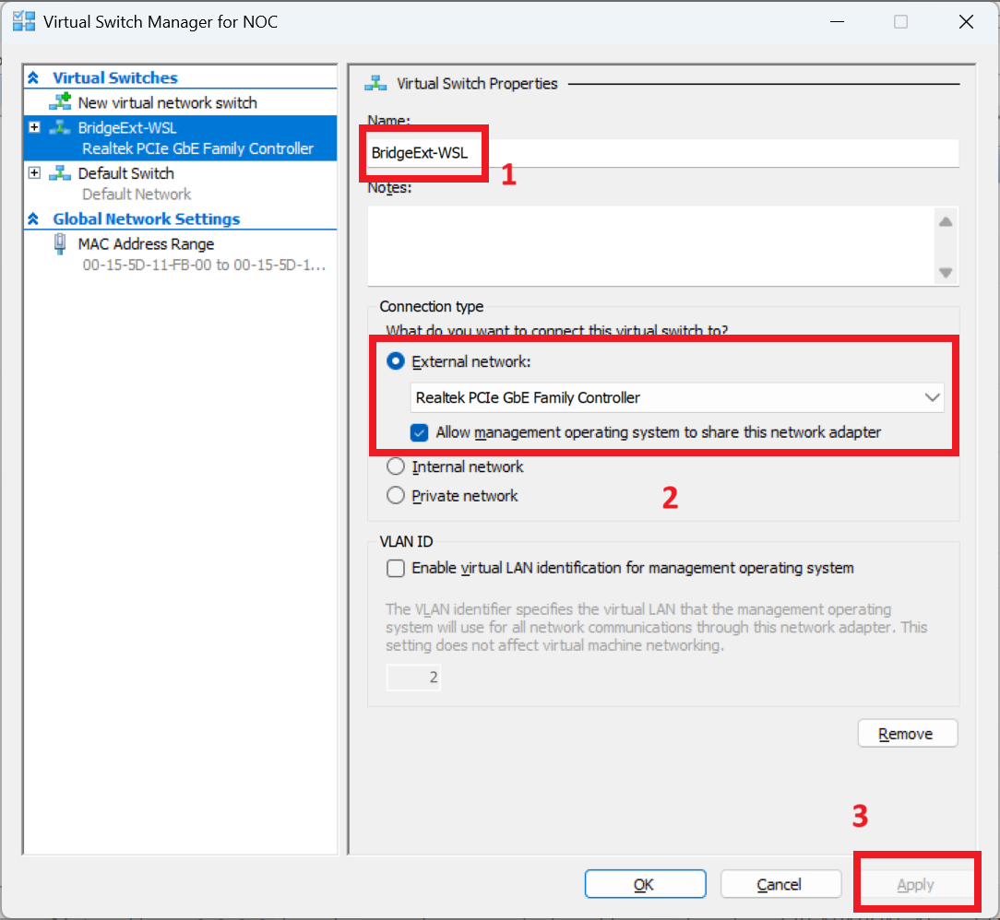
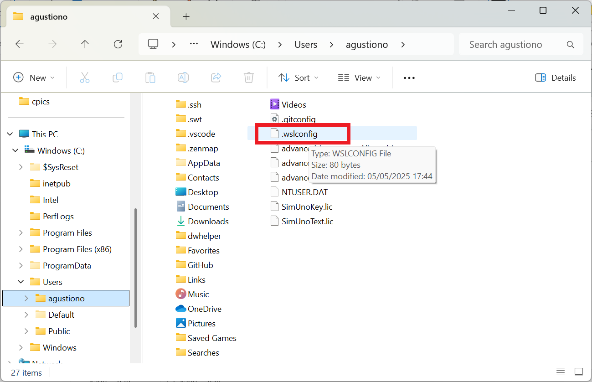
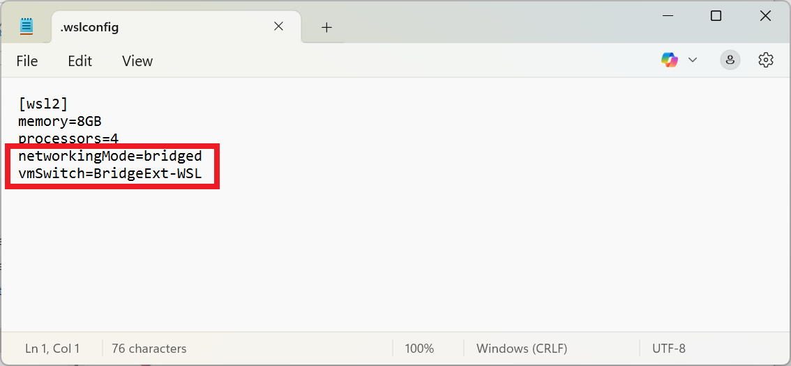

### Install Linux with WSL
- See all available distros `wsl --list --online`
- Install Linux Distro `wsl --install -d Ubuntu-22.04`
- See all your currently installed distros `wsl -l -v`
- Uninstall distro `wsl --unregister Ubuntu-22.04`


### Remove Linux Distro from WSL
Note. "Terminal must be access from administrator"
```
C:\Windows\System32>winget list ubuntu
Name   Id                    Version     Source
------------------------------------------------
Ubuntu Canonical.Ubuntu.2204 2204.2.33.0 winget

C:\Windows\System32>winget uninstall  Canonical.Ubuntu.2204
Found Ubuntu 22.04 LTS [Canonical.Ubuntu.2204]
Starting package uninstall...
  ██████████████████████████████  100%
Successfully uninstalled

C:\Windows\System32>
```

### Mengakses distribusi WSL 2 dari jaringan area lokal (LAN) Anda







#### The last step is to tell WSL which network it should use.
In a way, we say which network port it should connect to.

Create a new file in the root of the user profile (C:UsersYOURUSERNAME) called ".wslconfig", and insert the text below:


```
[wsl2]
networkingMode=bridged
vmSwitch=wsl-bridge
```


Then save and close the file.

For the file to be taken into account, it is necessary to force the shutdown of WSL.
To do this, run the following command in PowerShell:

```
wsl --shutdown
```
Once done, you can now reopen WSL, and the network will now be in bridge mode.


Saat menggunakan distribusi WSL 1, jika komputer Anda dikonfigurasi untuk diakses oleh LAN Anda, maka aplikasi yang dijalankan di WSL juga dapat diakses di LAN Anda.

Ini bukan kasus default di WSL 2. WSL 2 memiliki adaptor ethernet tervirtualisasi dengan alamat IP uniknya sendiri. Saat ini, untuk mengaktifkan alur kerja ini, Anda harus melalui langkah-langkah yang sama seperti yang Anda lakukan pada mesin virtual biasa. (Kami mencari cara untuk meningkatkan pengalaman ini.)

Berikut ini contoh penggunaan perintah Windows portproxy antarmuka Netsh untuk menambahkan proksi port yang mendengarkan port host Anda dan menghubungkan proksi port tersebut ke alamat IP untuk VM WSL 2.
```
netsh interface portproxy add v4tov4 listenport=<yourPortToForward> listenaddress=0.0.0.0 connectport=<yourPortToConnectToInWSL> connectaddress=(wsl hostname -I)
```
Dalam contoh ini, Anda perlu memperbarui `<yourPortToForward>` nomor port, misalnya `listenport=4000`. `listenaddress=0.0.0.0` berarti permintaan masuk akan diterima dari alamat IP APAPUN. Alamat Dengar menentukan alamat IPv4 yang akan didengarkan dan dapat diubah ke nilai yang mencakup: alamat IP, nama NetBIOS komputer, atau nama DNS komputer. Jika alamat tidak ditentukan, *defaultnya* adalah komputer lokal. Anda perlu memperbarui `<yourPortToConnectToInWSL>` nilainya ke nomor port tempat Anda ingin WSL terhubung, misalnya `connectport=4000`. Terakhir, `connectaddress` nilainya harus berupa alamat IP distribusi Linux Anda yang diinstal melalui WSL 2 (alamat VM WSL 2), yang dapat ditemukan dengan memasukkan perintah: `wsl.exe hostname -i`.

Jadi perintah ini mungkin terlihat seperti:
```
netsh interface portproxy add v4tov4 listenport=4000 listenaddress=0.0.0.0 connectport=4000 connectaddress=192.168.101.100
```
Untuk mendapatkan alamat IP, gunakan:
```
wsl hostname -i
```
untuk alamat IP distribusi Linux Anda yang diinstal melalui WSL 2 (alamat VM WSL 2)
`cat /etc/resolv.conf` untuk alamat IP mesin Windows seperti yang terlihat dari WSL 2 (VM WSL 2)
Menggunakan `listenaddress=0.0.0.0` akan mendengarkan semua port IPv4 .
Reff = [accessing-a-wsl-2-distribution-from-your-local-area-network-lan](https://learn.microsoft.com/en-us/windows/wsl/networking#accessing-a-wsl-2-distribution-from-your-local-area-network-lan)
