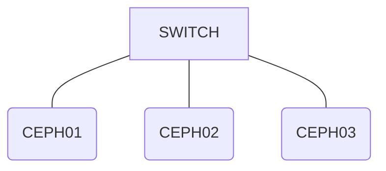

### testing scripts

> [!NOTE]
> - &#129001; Not yet running/proccessing
> - :white_check_mark: Completed
> - :negative_squared_cross_mark: Empty/Failed

<h4>kolang kaling</h4>

    
> [!IMPORTANT]
> Isi aja apa aja lahi, namanya juga testing **mantab**. 
> |  | Readme | Schema | Research | Implementation | Documentation | Config-data |
> :----- |:----|:----|:----|:----|:----|:----
>  Status | &#129001;[Links]() | &#129001;[Links]() | &#129001;[Links]() | &#129001;[Links]() | :white_check_mark:[Links]() | :negative_squared_cross_mark:[Links]() | 

<h4>Nyari kuda</h4>

> [!WARNING] 
> Isi aja apa aja lahi, namanya juga testing **mantab**. 
> |  | Readme | Schema | Research | Implementation | Documentation | Config-data |
> :----- |:----|:----|:----|:----|:----|:----
>  Status | &#129001;[Links]() | &#129001;[Links]() | &#129001;[Links]() | &#129001;[Links]() | :white_check_mark:[Links]() | :negative_squared_cross_mark:[Links]() | 

> [!NOTE]  
> Highlights information that users should take into account, even when skimming.
> | pantangan | kunci | makan | aristorakat | megamawarni |
> | :--- | :--- | --- | ---:| ---:|
> | perut | kuncina | hari ini | merry | kaget |
> 

> [!IMPORTANT]  
> Crucial information necessary for users to succeed.

> [!WARNING]  
> Critical content demanding immediate user attention due to potential risks.

> [!IMPORTANT]
> **Site-Danareksa**
>
> |  | Readme | Schema | Research | Implementation | Documentation | Config-data |
> |:---:|:---:|:---:|:---:|:---:|:---:|:---:|
> | Status | &#129001; | &#129001; | &#129001; | &#129001; | :white_check_mark: | :negative_squared_cross_mark: | 
>

Site Danareksa

    

    
> |  | Readme | Schema | Research | Implementation | Documentation | Config-data |
> :----- |:----|:----|:----|:----|:----|:----
>  Status | &#129001;[Links]() | &#129001;[Links]() | &#129001;[Links]() | &#129001;[Links]() | :white_check_mark:[Links]() | :negative_squared_cross_mark:[Links]() | 
    

    
> |  | Readme | Schema | Research | Implementation | Documentation | Config-data |
> :----- |:----|:----|:----|:----|:----|:----
>  Status | &#129001;[Links]() | &#129001;[Links]() | &#129001;[Links]() | &#129001;[Links]() | :white_check_mark:[Links]() | :negative_squared_cross_mark:[Links]() | 
    

