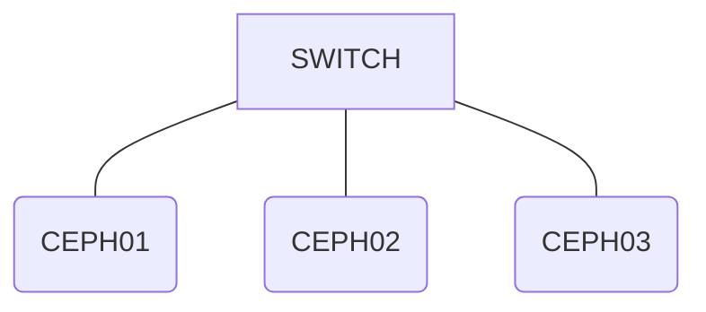

### testing scripts

> [!NOTE]  
> Highlights information that users should take into account, even when skimming.

> [!IMPORTANT]  
> Crucial information necessary for users to succeed.

> [!WARNING]  
> Critical content demanding immediate user attention due to potential risks.
